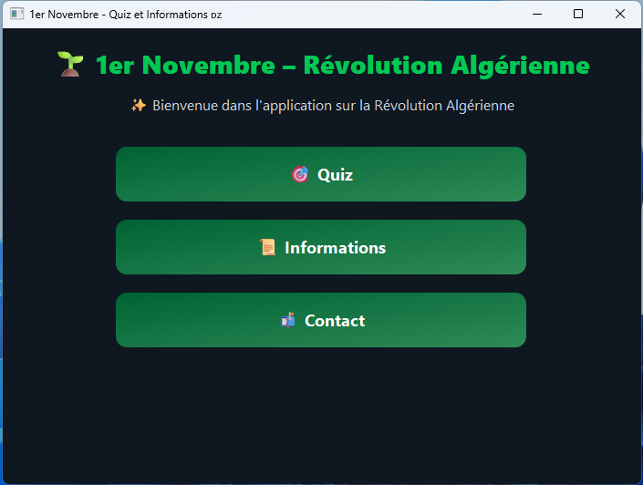
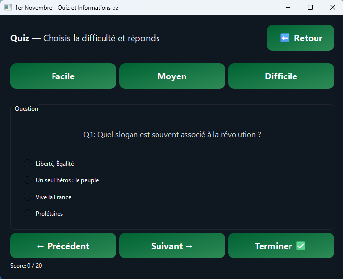
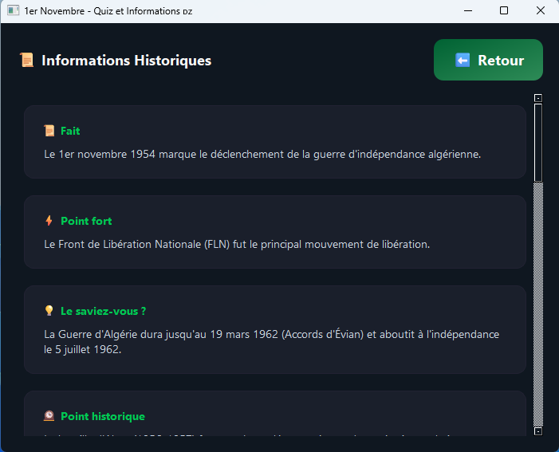

# 🌱 RevoQuiz – Algerian Revolution Quiz & Info App

**Description**  

  

Algerian Revolution Quiz & Info App. Explore Algeria’s fight for independence through this interactive desktop app. Learn key historical facts, test your knowledge with quizzes, and discover important events, leaders, and milestones. Engaging, educational, and fully in French for an authentic experience.

---

## Features
- 🇩🇿 Fully in French: quizzes, info, and UI.
- 🎯 Quiz mode: Easy, Medium, Hard levels.
- 📜 Info mode: Learn about events, leaders, and milestones.
- 📬 Contact page with social media & email links.
- Desktop app for Windows, ready to run.

---

## Screenshots

  

  

  

---

## How to Run
1. Download the `.exe` file.
2. Double-click to launch the app.
3. Explore quizzes and information about the Algerian Revolution.

---

## Contact
- Facebook: [TechCraft Han](https://www.facebook.com/profile.php?id=61578273497973&sk=about)  
- Instagram: [@techcraft_han](https://www.instagram.com/techcraft_han)  
- Email: saharaoui.info@gmail.com

---

## License
This application is free to share and enjoy!
